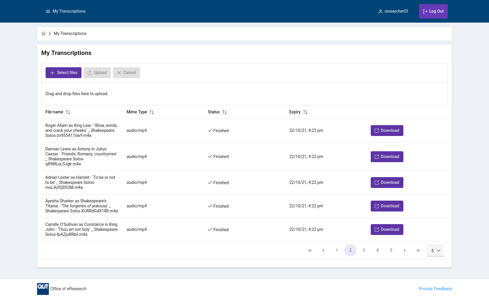
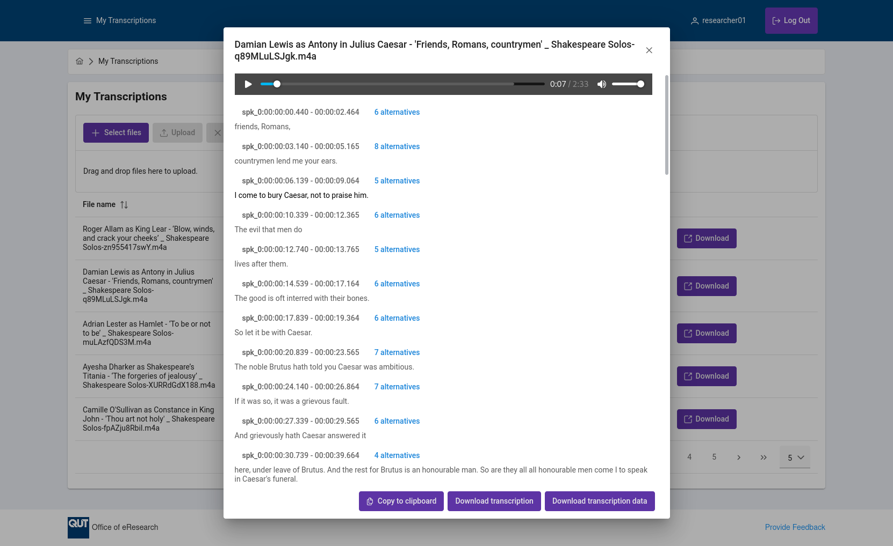

# Transcription

[eResearch QUT](https://www.qut.edu.au/research/office-of-eresearch) Transcription Service




[Custom deployment instructions](INSTRUCTIONS.md)

## Linting and Formatting

### Frontend

```
cd frontend
yarn lint
yarn fmt
```

### API

```
cd api
npm run lint
npm run fmt
```

Ignore formatting revisions in `.git-blame-ignore-revs`:

```
git config blame.ignoreRevsFile .git-blame-ignore-revs
```

## Manual deployment instructions

```
export ENV=dev # or qa, prod

export STACK_NAME=$ENV-transcription
export LAMBDA_BUCKET_NAME=qut-lambda-code-ap-southeast-2-dev
export S3_PREFIX=dev-transcription
```

### In root

```
sam build
sam deploy --s3-bucket $LAMBDA_BUCKET_NAME --s3-prefix $ENV-$STACK_NAME --stack-name $STACK_NAME --capabilities CAPABILITY_IAM --profile account-role
aws cloudformation describe-stacks --stack-name $STACK_NAME --query "Stacks[0].Outputs[?OutputKey=='FrontEndEnvironment'].OutputValue" --output text --profile account-role | sed '/^[[:space:]]*$/d' > ./frontend/.env.production
```

### In frontend

```
yarn install
yarn build-$ENV
export $(aws cloudformation describe-stacks --stack-name $ENV-transcription --region ap-southeast-2 --query "Stacks[0].Outputs[?OutputKey=='DistributionEnvironment'].OutputValue" --output text | sed '/^[[:space:]]*$/d' | xargs)
aws s3 sync frontend/build $DISTRIBUTION_BUCKET
aws cloudfront create-invalidation --distribution-id $DISTRIBUTION_ID --paths "/*"
```
