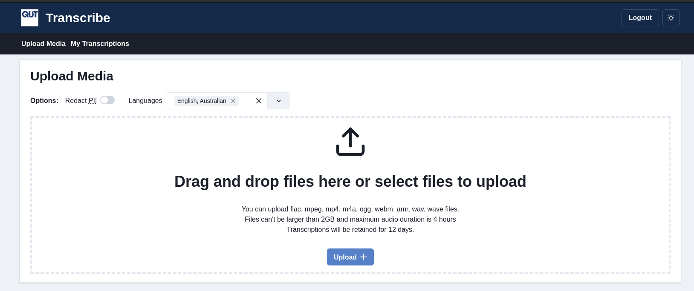
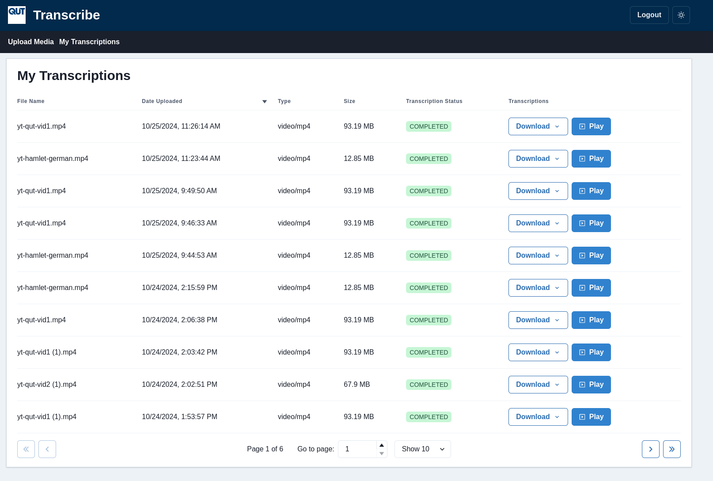
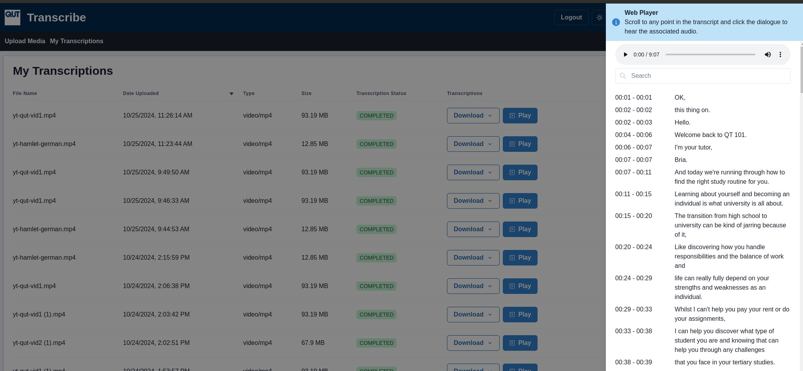

# Transcription

[eResearch QUT](https://www.qut.edu.au/research/office-of-eresearch) Transcription Service





This application is monorepo using a pnpm workspace.

* `pnpm build`
* `pnpm install`
* `pnpm test`
* `pnpm test:integration` (needs a running local stack, see below)

## Local frontend development
1. Copy the dev environment variables into your local `.env.local`
```
cd frontend
export STACK_NAME=dev-transcription
aws cloudformation describe-stacks --stack-name $STACK_NAME --query "Stacks[0].Outputs[?OutputKey=='FrontEndEnvironment'].OutputValue" --output text > .env.local
```
2. Modify `.env.local` to redirect to the local app after login:
```
NEXT_PUBLIC_AUTH_SIGN_IN_REDIRECT=http://localhost:3000/
```
3. Start the app against the deployed dev environment
```
pnpm dev:frontend
```

To run the app against the local MiniStack emulator instead, use `pnpm dev`,
which starts the emulator and CDK deploy first and then the Next server.

### Summarisation against the local stack

Summarisation calls Bedrock, which MiniStack answers with a canned
Anthropic-shaped reply. Nothing needs installing: an upload with "generate
summary" enabled produces a summary object, and its text reads

```
[ministack mock anthropic anthropic.claude-3-haiku-20240307-v1:0] reply for prompt#23d42284
```

The shape is right and the content is a digest of the prompt, so the chain can
be exercised but the summary itself means nothing. That is usually what you
want locally.

For real summaries, point MiniStack at any OpenAI-compatible
`/chat/completions` endpoint. With [Ollama](https://ollama.com) serving on its
default port:

```
MINISTACK_BEDROCK_PROXY_URL=http://host.docker.internal:11434 pnpm ministack:up
```

Give the base URL only; MiniStack appends `/v1/chat/completions`. The variable
is read at startup, so it must be set when the container is created rather than
exported later. Recreating the container wipes the emulator's state, so a
redeploy follows.

Be aware that MiniStack falls back to the canned reply **silently** when the
proxy is unreachable. A stopped or misaddressed proxy looks like a working run
with placeholder text, not an error. Check for the `[ministack mock` prefix
before trusting a summary, and before asserting on one in a test.

### Integration tests against the local stack

`pnpm test` mocks the AWS SDK throughout and needs no Docker. It therefore
never checks that the S3 notification filters, EventBridge rules and IAM grants
in `deployment/lib/api-stack.ts` reach the handlers.

`pnpm test:integration` covers that. It uploads to the running local stack and
follows the chain to a stored transcript, summary and translation. Start the
stack first:

```
docker compose up -d      # wait for the deploy, watch with pnpm ministack:logs
pnpm test:integration
```

It targets whatever stack is already up rather than starting its own, so it
does not run in CI. `api/test/integration/README.md` records that decision and
what the suite deliberately leaves uncovered.

## Linting and Formatting

### Frontend

```
pnpm --filter frontend lint
pnpm --filter frontend fmt
```

### API

```
cd api
pnpm --filter transcription-api lint
pnpm --filter transcription-api fmt
```

Ignore formatting revisions in `.git-blame-ignore-revs`:

```
git config blame.ignoreRevsFile .git-blame-ignore-revs
```

## Manual deployment instructions

```
cd api
pnpm install
```

```
cd frontend
pnpm install
mkdir -p out
```

```
cd deployment
npm install
```

### *Optional: Create GitHub deployment stack*

```
export GITHUB_REF_NAME=dev
export GITHUB_FILTERS="environment:dev"
cdk deploy TranscriptionGitHubStack
cdk deploy TranscriptionFrontEndGitHubStack
```

### *Optional: Assume the GitHub role locally*


`~/.aws/config`:

```
[profile qut-dev]
region = ap-southeast-2

[profile qut-dev-github]
role_arn = <TranscriptionGitHubStack.deployRoleArn>
source_profile = qut-dev
region = ap-southeast-2

[profile qut-dev-github-frontend]
role_arn = <TranscriptionFrontEndGitHubStack.deployRoleArn>
source_profile = qut-dev
region = ap-southeast-2
```

Deploy the stacks with the GitHub role:

```
AWS_PROFILE=qut-dev-github cdk deploy TranscriptionStack
AWS_PROFILE=qut-dev-github-frontend cdk deploy TranscriptionFrontEndStack
```

### Deploy base stack

Also builds the lambda functions

```
cdk deploy TranscriptionStack
```

### Build the frontend

```
export STACK_NAME=dev-transcription
aws cloudformation describe-stacks --stack-name $STACK_NAME --query "Stacks[0].Outputs[?OutputKey=='FrontEndEnvironment'].OutputValue" --output text > ../frontend/.env.production
```

From the top-level `frontend` directory:

```
pnpm build
```

### Deploy frontend stack

```
cdk deploy FrontEndStack
```